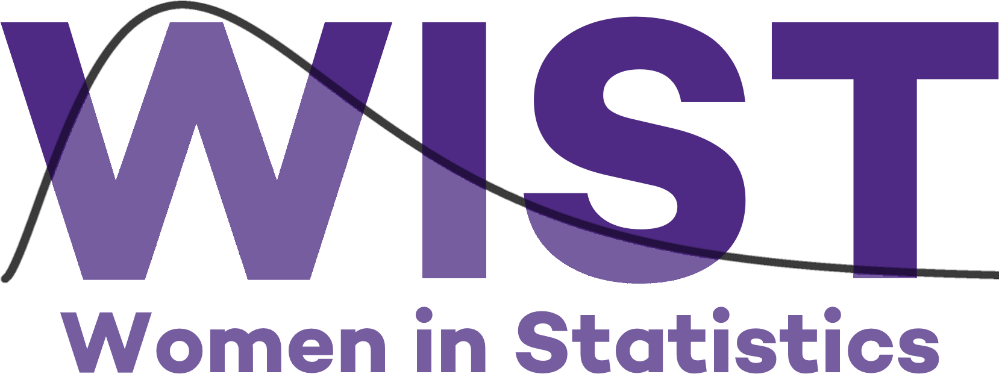

Women in Statistics (WIST) is focused on building community among self-identifying women in statistics (including any fields that use statistics or data science).  The organization seeks to increase representation of women in statistics and strives to create a mentoring environment, through professional development and learning opportunities.  

Internal Communications Chair responsibilities focus on managing communications with WIST members including:  
<ul>
  <li> Creating and distributing paper and virtual flyers  
  <li> Organizing WIST members schedules to identify optimal event times
  <li> Maintaining website  
  <li>Schedule quarterly WIST lunches
</ul>

Additionally, I worked for the
[Women in Data Science (WiDS) Chicago Regional Event](https://widschicago.org/)
by helping put together the slide deck for the event
and day-of event administration.

### Marketing Materials
<ul>
<li> Designed WIST logo 

 
<li> Designed Women in Data Science (WiDS) logo for regional Chicago event 

 <small> <i> Note: This logo was not used on the WiDS website, but was put on hex stickers given away at the event.</small> </i> 
 

 
<li> Flyer for Brown Bag Lunches 

<a href="20191115.png"> 
Example </a>

 

<li> Flyer for Workshops 

<a href="20190926.pdf"> 
Example </a>

 

<li> Flyer for Discussions 

<a href="202001.pdf"> 
Example </a>

 

</ul> 

